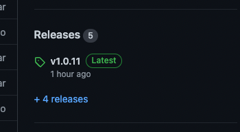

### Publish on NPM

- [login to your npm account](http://npm.github.io/installation-setup-docs/installing/logging-in-and-out.html)
- make sure to update the version of the package on `package.json`
- inside projects folder run `npm publish`
- on github download the code to your machine and upload it to create a new release
  
