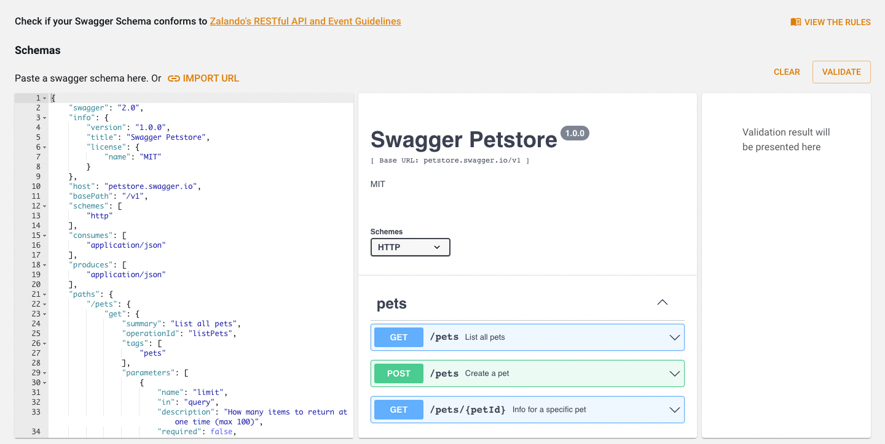

[](https://github.com/zalando/backstage-api-linter-plugin/actions/workflows/node.js.yml)

# backstage-plugin-api-linter

Welcome to the Backstage Plugin API Linter!

API Linter is a quality assurance tool. Its main purpose is to check the compliance of API's specifications to Zalando's
API rules.

The plugin's UI is able to lint the API specification in OpenAPI format. The result of the linting is a set of
Violations. A violation contains information about the violated rule, its severity, and path of the violation in the
specification document.

This plugin is an UI using [Zally](https://github.com/zalando/zally) as a backend.

## Getting started

Add the plugin to your frontend app:

```
cd packages/app && yarn add backstage-plugin-api-linter
```

On your `app-config.yaml` configure the proxy endpoint of the plugin.

```yaml
proxy:
  '/api-linter':
    target: <your-zally-instance-url>
    allowedHeaders: ['Authorization']
```

#### Using ApiLinter:

First export the plugin on `app/App.tsx` file:

```js
export { APILinterPlugin } from 'backstage-plugin-api-linter';
```

Then use the component on your application!

With [tabbed layout](https://backstage.io/storybook/?path=/story/navigation-tabbedlayout--default):

```jsx
<TabbedLayout>
  <TabbedLayout.Route path="/" title="another title">
    <AnotherExampleComponent/>
  </TabbedLayout.Route>
  <TabbedLayout.Route path="/linter" title="LINTER" data-id="api-linter">
    <APILinter/>
  </TabbedLayout.Route>
</TabbedLayout>
```

Content

```javascript
<Content>
  <APILinter/>
</Content>
```



## How to track user behaviour

We are currently using Google Analytics for tracking the user behavior.
To track the plugin you can pass your google Analytics functions as props to the `APILinter` component.

```jsx
<APILinter
  sendEvent={PluginTracking.sendEvent}
  sendPageView={PluginTracking.sendPageView}
  eventInfo={{
    plugin: 'api-linter',
    eventCategory: 'API linter page',
  }}
/>
```

#### where

- sendEvent is:

```javascript
function sendEvent(args: IEventTracking) {
  GoogleAnalytics.event({
    plugin: args.plugin,
    category: args.eventCategory,
    action: args.eventAction,
    label: args.eventLabel,
  });
}
```

```ts
interface IEventTracking {
  plugin: string;
  eventLabel: string;
  eventAction: string;
  eventCategory: string;
}
```

- sendPageView is:

```javascript
function sendPageView() {
  GoogleAnalytics.set({page: window.location.pathname});
  GoogleAnalytics.pageview(window.location.pathname + window.location.search);
}
```

- eventInfo is:

```ts
interface ICommonEventInfo {
  plugin: string;
  eventCategory: string;
}
```

eventInfo will be the same for all events

#### Tracked events are:

- page view
- clicks on Zalando's guideline link
- clicks on import url
- hover on url input
- validate by url
- cancel validate by url
- clicks on schema input
- validate by schema input
- clicks to view rules
- clicks on individual rule cards
- clicks on tags (must, should, may)
- clicks on links on rule cards
- clicks on validate by schema button
- hovers on api badge
- hovers on api badge text
